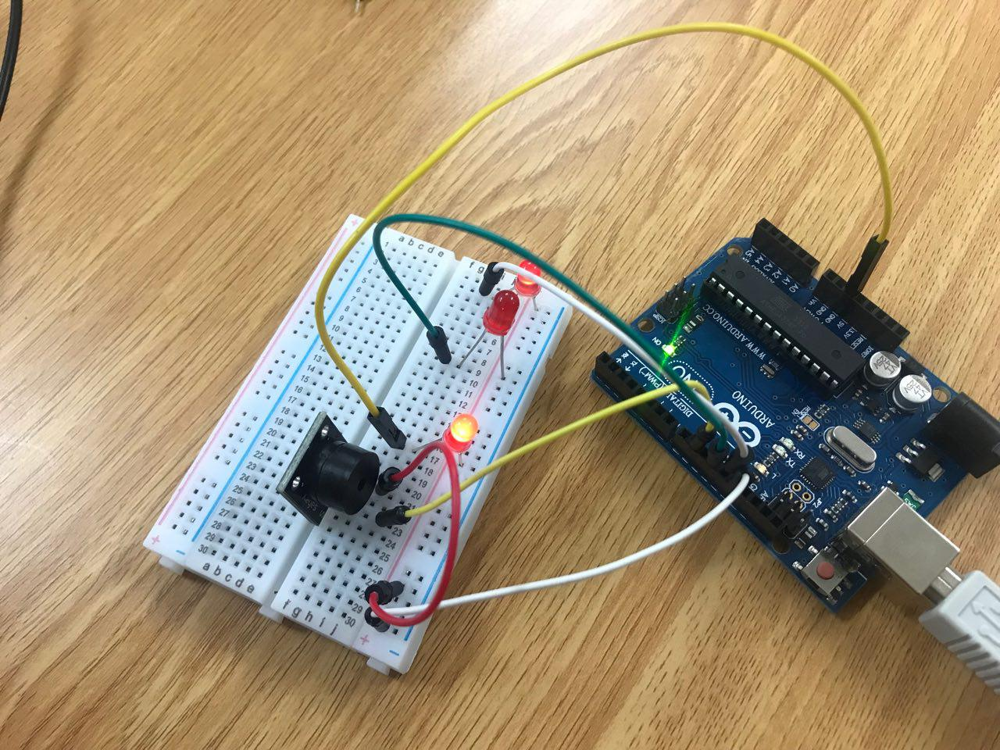

# Práctica Arduino 4 por Hakim y Eros
- Un servo motor
- Una placa Arduino (por ejemplo la R3)
- Una protoboards


```C
#include <Servo.h>                    // Incluir la librería Servo
Servo servo1;                         // Crear un objeto tipo Servo llamado servo1
int angulo = 0 ;
int pin=9;
void setup()
{
        servo1.attach(pin) ;             // Conectar servo1 al pin 9
}

void loop()
{
        for(angulo  = 0; angulo  <= 180; angulo  += 1)   //incrementa angulo 1 grado
            {
                 servo1.write(angulo);
                 delay(25);
            }
        for(angulo  = 180; angulo  >=0; angulo  -=1 )    //decrementa angulo 1 grado
            {
                 servo1.write( angulo );
                 delay(25);
            }
}

```
___
### Imágenes

___
### Funcionalidad
Simulación y comprueba que la luces se enciende consecutivamente que el servo se mueve. 
